# Dokumentasi Tugas Konversi Java ke PHP

**Data Mahasiswa:**
* **Nama:** Muhammad Faathir Madani
* **NPM:** 4525210100
* **Mata Kuliah:** Pemrograman Berbasis Objek

---

# Folder 01 - Pengenalan Class & Object

### Hasil Running Program Java
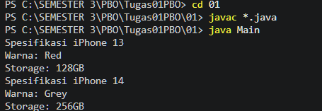

### Hasil Running Program PHP
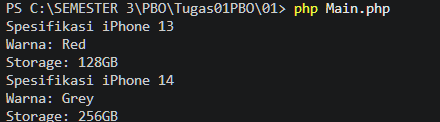

---

# Folder 02 - Constructor Overloading & Encapsulation

### Hasil Running Program Java

### Hasil Running Program PHP
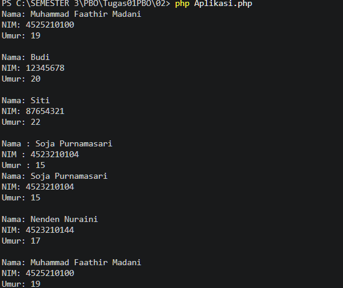

---

# Folder 03 - Inheritance (Pewarisan)

### Hasil Running Program Java
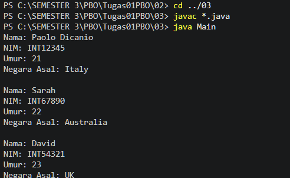

### Hasil Running Program PHP
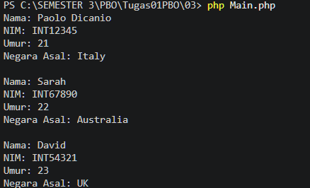

---

# Folder 04 - Polymorphism

### Hasil Running Program Java
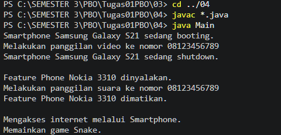

### Hasil Running Program PHP
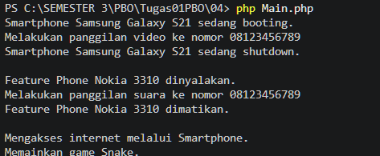

---

# Folder 05 - Relasi Antar Objek

### Hasil Running Program Java
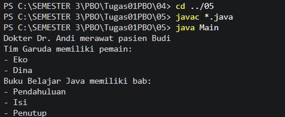

### Hasil Running Program PHP
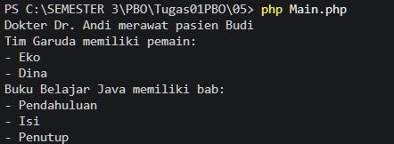

---

# Folder 06 - Abstract Class & Interface

### Hasil Running Program Java
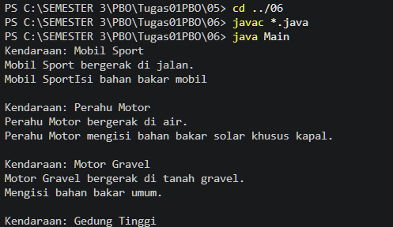

### Hasil Running Program PHP
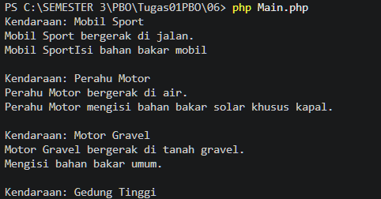